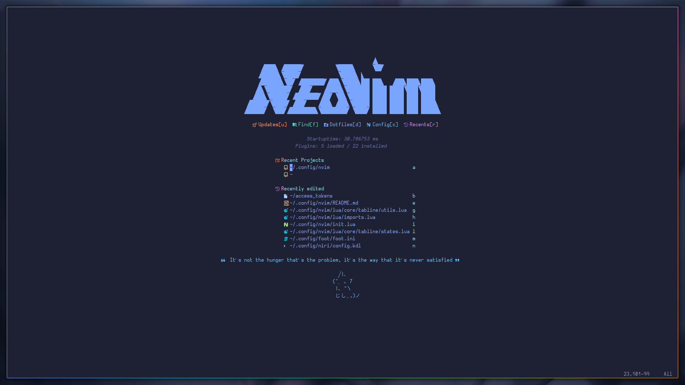
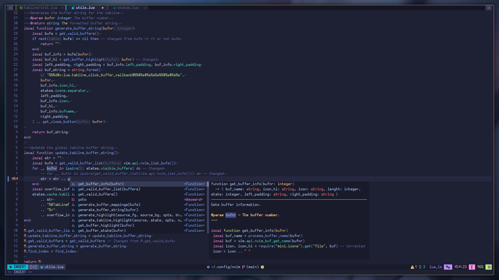
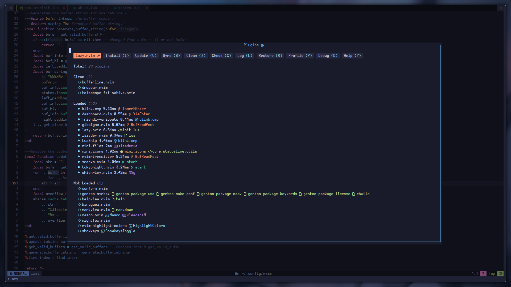
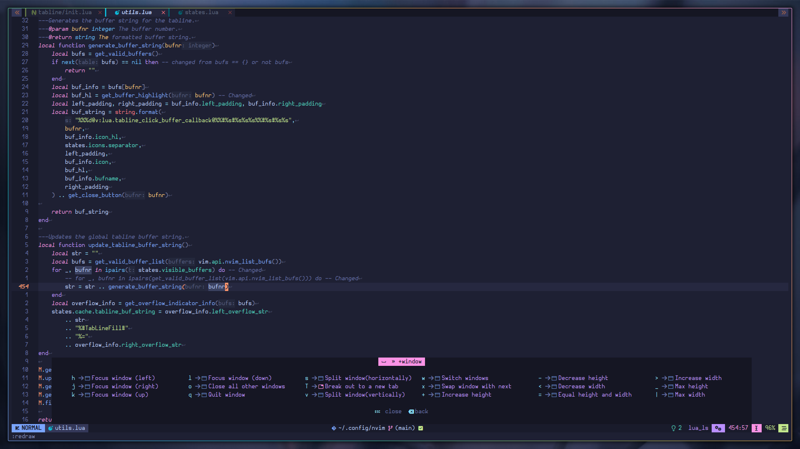

# NEOVIM CONFIG
This is my personal neovim config that I have developed thoughout my journey of daily driving neovim. It may or may not suit your needs but if it does, I'm happy to hear that.

> [!Note]
> As of right now, this config is somewhat experimental but functional as changes are undergoing onl the fly, the code is a mess rn (I'm trying my best to clean that). Any issues that I tackle, I try to fix them asap.
> However if you try out this setup (which is greatly appreciated) and encounter any issues, I'd be more than happy to fix them up. PR's are more than welcomed.


# SHOWCASE





# Install Instructions

To get the setup up and running.
Firstly backup your current neovim setup.
```bash
mv ~/.config/{nvim,nvim.bak}
mv ~/.local/share/{nvim,nvim.bak}
```

Now, simply clone the repository into your `$XDG_CONFIG_HOME/nvim` directory.
```bash
git clone htps://gitlab.com/100x65b1111000/nvim.git ~/.config/nvim
nvim
```

# Features
1. Home baked statusline ( ~500 loc ) and tabline ( ~500 loc) with minimalism and aesthetics in mind, however not configurable (yet?).
2. Reasonable defaults for newbies like me.
3. [lazy.nvim](https://github.com/folke/lazy.nvim) for plugin management.
4. Customized dashboard with [dashboard.nvim](https://github.com/nvimdev/dashboard.nvim).
